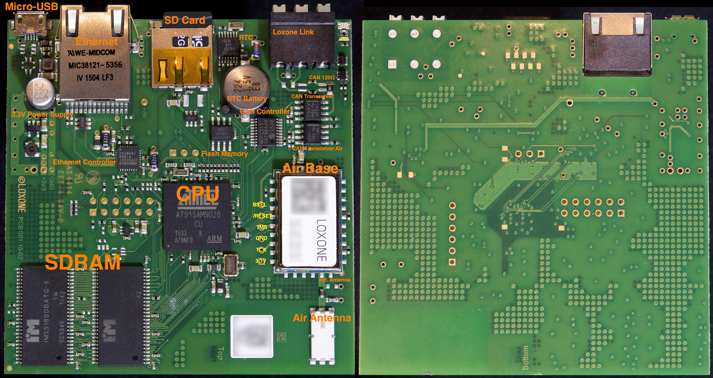

# Inside the Loxone Miniserver Go

The Loxone Miniserver Go is build around the same hardware, as the regular Miniserver:

- [Atmel SAM9G20 ARM CPU][1]
- serial interface Flash memory ([AT25SF041][1b] from Adesto Technologies)
- Two [256MB SDRAM][3] chips, providing 64MB of RAM to the Miniserver
- [4-megabit FLASH memory][2]
- [Ethernet][4]
- [Real-Time Clock][5]
- Micro-SD Card Slot
- [CAN Bus][11] with a [CAN controller][12] and a [CAN transceiver][13], used for the Loxone Link bus and the only way besides Loxone Air to connect extensions to the Miniserver Go.

Details about them can be found in my description of the Loxone Miniserver hardware.

The power supply is using a Micro-USB connector, generating the 3.3V needed for the board.

Missing are most of the inputs and outputs:
- no KNX port
- no digital ins
- no Relays / Digital Out
- no Analog In
- no Analog Out
- no Digital In

## Air Base Extension in Miniserver Go

The Loxone Miniserver Go features a built-in Air Base Extension with a built-in antenna.

The Miniserver Go does not support an external antenna. That said, it should be possible to modify the board to use an external connector:
- move the 0Ω resistor connecting pin 31 with the built-in antenna to the soldering pad to the right.
- Add an SMA connector to the board and connect it to the spot at the right of the board. The bottom connectors should be ground, the center should be connected to the upper pin, which is connected via the resistor the pin 31 of the chipset.
- Modify the plastic housing to have the connector accessible outside.

The antenna needs to be a 50Ω 868Mhz antenna – just like the one Loxone ships for the Air Base Extension.

The build-in Air Base extension in the Miniserver Go is connected to the Loxone Link CAN bus like any other extension, which means the [ZWIR4502][14] (a wireless chipset based on the STM32 ARM CPU) is connected via an additional [CAN transceiver][13] to the bus.

All Air extensions and devices, even battery powered ones, seem to be using this chipset.

The Air Base Extension has a fixed serial number of 0C000001. Because there can be only one Miniserver Go on the Loxone Link bus, there will never be a conflict by having a static serial number.

## Photo with Labels of the Mainboard

 [1]: https://www.microchip.com/wwwproducts/en/AT91SAM9G20
 [1b]: https://www.adestotech.com/wp-content/uploads/DS-AT25SF041_044.pdf
 [2]: https://www.adestotech.com/wp-content/uploads/doc3668.pdf
 [3]: https://www.skhynix.com/eolproducts.view.do?pronm=SDR+SDRAM&srnm=H57V2562GTR&rk=01&rc=consumer
 [4]: https://www.nxp.com/docs/en/data-sheet/PCF2123.pdf
 [5]: https://www.nxp.com/products/analog/signal-chain/real-time-clocks/rtcs-with-spi/spi-real-time-clock-calendar:PCF2123
 [6]: http://www.hongfa.com/pro/pdf/HF33F_en.pdf
 [7]: http://www.analog.com/media/en/technical-documentation/data-sheets/ADUM3400_3401_3402.pdf
 [8]: http://www.analog.com/media/en/technical-documentation/data-sheets/AD5724_5734_5754.pdf
 [9]: http://www.ti.com/lit/ds/slas139c/slas139c.pdf
 [10]: http://www.ti.com/lit/ds/symlink/sn65hvs882.pdf
 [11]: https://de.wikipedia.org/wiki/Controller_Area_Network
 [12]: http://ww1.microchip.com/downloads/en/DeviceDoc/21801d.pdf
 [13]: http://www.ti.com/lit/ds/symlink/sn65hvd230.pdf
 [14]: https://www.idt.com/products/interface-connectivity/ipv6-modules/zwir4512-secure-low-power-wireless-ipv6-module
 